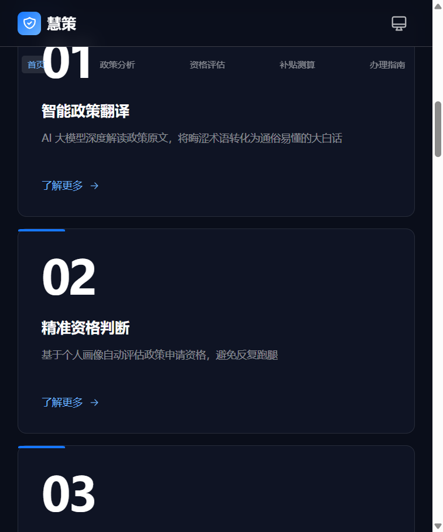

<div align="center">

# 慧策 · HuìCè

**AI 驱动的惠民政策智能服务平台**

让每一位普通人都能读懂政策、算清补贴、办成事项

[在线体验](#-在线体验) · [核心功能](#-核心功能) · [技术架构](#-技术架构) · [快速开始](#-快速开始) · [部署上线](#-部署上线)

---



</div>

## 项目愿景

在中国，每年有数千项惠民政策密集出台，但真正触达目标人群的比例不足 30%。问题不在政策本身，而在**信息鸿沟**——

> 政策的语言是法律语言，群众的语言是生活语言。

**慧策** 通过大模型把"法律语言"实时翻译成"生活语言"，并用 AI 完成**资格判断 → 补贴测算 → 办理指引**的全流程闭环，让 60 岁的老人、刚休完产假的新手妈妈、刚找到第一份灵活工作的骑手，都能像查天气一样查政策。

---

## 核心功能

### 1. 政策大白话翻译

上传 PDF / TXT 政策文件，AI 在 5 秒内将晦涩条款转写为普通人能看懂的语言，并自动高亮**关键数字、条件、时间、金额**。

### 2. 智能资格评估

AI 自动从政策中抽取申请条件，生成"逐条问答"评估流程，用户点击按钮即可完成判断，最终输出可视化结果：

- 🟢 **完全符合** — 立刻告诉你下一步该做什么
- 🟡 **部分符合** — 指出还差什么条件
- 🔴 **不符合** — 给出相似政策的备选建议

### 3. 补贴金额测算

基于个人画像（年龄、户籍、收入、参保情况等），AI 自动计算可申领补贴的具体金额，**不再靠猜、不再跑窗口问**。

### 4. 办理指南生成

输出 Mermaid 流程图 + 文字步骤 + 材料清单 + 注意事项，**打印出来照着办**也成立。

### 5. 适老化无障碍

按 DB44/T 2678-2025《移动政务"适老化"用户体验设计标准》实现：

| 功能 | 说明 |
|------|------|
| 字体三档 | 标准 16px / 大 20px / 超大 24px |
| 高对比度 | 深色文字 + 浅黄背景，符合 WCAG AA |
| 语音播报 | Web Speech API 朗读政策与评估结果 |
| 大触控区 | 所有按钮 ≥ 44×44px |

---

## 五大惠民政策场景

应用已内置 5 类高频惠民政策的真实示例，用户无需上传文件即可完整体验：

| 场景 | 标签色 | 典型政策 |
|------|--------|----------|
| 🏥 医保报销 | 蓝 | 城镇职工医保门诊/住院报销 |
| 🌸 生育津贴 | 粉 | 生育津贴申领与发放标准 |
| 💼 灵活就业补贴 | 绿 | 灵活就业人员社保补贴 |
| 🌅 高龄补贴 | 橙 | 80 岁以上老人津贴发放 |
| ⭐ 人才补贴 | 紫 | 高校毕业生租房/生活补贴 |

---

## 技术架构

### 系统拓扑

```
┌────────────────────────────────────────────────────┐
│                    浏览器（评审）                   │
│   React 19 + TypeScript + Vite + TailwindCSS       │
└──────────────────────┬─────────────────────────────┘
                       │ HTTPS / JSON
                       ▼
┌────────────────────────────────────────────────────┐
│              Node.js + Express 服务端              │
│   pdf-parse · Mermaid · JSON Schema 校验           │
└──────────┬──────────────────────────┬─────────────┘
           │                          │
           ▼                          ▼
   ┌──────────────┐         ┌────────────────────┐
   │  DeepSeek V4 │         │  通义千问 / 智谱GLM│
   │   主推理     │         │  OpenAI 兼容 API   │
   └──────────────┘         └────────────────────┘
```

### 技术栈

| 层级 | 选型 | 说明 |
|------|------|------|
| 前端框架 | React 19 + TypeScript | 类型安全、组件化 |
| 构建工具 | Vite 5 | 极速 HMR，秒级冷启动 |
| 样式方案 | TailwindCSS 3 | 原子化 CSS，自定义品牌色 |
| 状态管理 | Zustand | 轻量、无样板代码 |
| 路由 | React Router 6 | 5 个核心页面 |
| 图表 | Mermaid 11 | 流程图渲染（neutral 主题） |
| 后端 | Node.js 18 + Express 4 | 稳定、社区大 |
| LLM | DeepSeek V4 / 通义千问 | OpenAI 兼容 + 结构化输出 |
| 文件解析 | pdf-parse v2.4.5 | PDF / TXT 文本提取 |
| 部署 | Vercel（前端）+ Render（后端） | 与 GitHub 联动自动部署 |

### 关键工程实践

- **结构化输出**：所有 AI 调用使用 `response_format: { type: 'json_schema' }`，确保返回可被前端安全解析
- **JSON Schema 校验**：用 AJV 校验 LLM 输出，挡住 99% 的脏数据
- **适老化持久化**：用户字号/对比度/朗读偏好存 localStorage，跨会话保留
- **Mermaid 容错**：固定使用 `neutral` 主题 + 10s 渲染超时保护，避免 v11 的 `getThemeColors` 报错

---

## 目录结构

```
大赛文件/
├── frontend/                  # React 前端
│   ├── public/                # 静态资源（favicon、icons）
│   ├── src/
│   │   ├── components/        # 通用组件
│   │   │   ├── accessibility/ # 适老化面板
│   │   │   └── charts/        # Mermaid 图表组件
│   │   ├── contexts/          # 适老化全局 Context
│   │   ├── hooks/             # 自定义 Hooks
│   │   ├── layouts/           # MainLayout（顶部导航 + 页脚）
│   │   ├── pages/             # 5 个业务页面
│   │   │   ├── Home/          # 首页（Hero + 五大场景）
│   │   │   ├── PolicyAnalysis/  # 政策分析
│   │   │   ├── Eligibility/     # 资格评估
│   │   │   ├── SubsidyCalc/     # 补贴测算
│   │   │   └── Guide/           # 办理指南
│   │   ├── services/          # API 调用封装
│   │   ├── stores/            # Zustand 全局状态
│   │   └── types/             # TypeScript 类型定义
│   ├── tailwind.config.js
│   ├── vite.config.ts
│   └── package.json
│
├── backend/                   # Node.js Express 后端
│   ├── src/
│   │   ├── app.js             # 入口
│   │   ├── config/            # 环境变量配置
│   │   ├── data/              # 5 类模拟政策数据
│   │   ├── middleware/        # 错误处理
│   │   ├── routes/            # 4 个业务路由 + 上传
│   │   ├── schemas/           # JSON Schema 校验
│   │   └── services/          # LLM 客户端 + Prompt 模板
│   ├── .env.example
│   └── package.json
│
├── docs/
│   └── screenshots/           # README 截图
└── README.md
```

---

## 快速开始

### 环境要求

- Node.js ≥ 18
- 一个 OpenAI 兼容的 LLM API Key（推荐 DeepSeek V4）

### 1. 启动后端

```bash
cd backend
cp .env.example .env
# 用编辑器打开 .env，填入你的 LLM_API_KEY
```

`.env` 配置项：

| 变量 | 必填 | 说明 | 默认值 |
|------|------|------|--------|
| `LLM_API_KEY` | ✅ | LLM 密钥 | — |
| `LLM_BASE_URL` | ❌ | OpenAI 兼容 API 地址 | `https://api.deepseek.com/v1` |
| `LLM_MODEL` | ❌ | 模型名 | `deepseek-chat` |
| `PORT` | ❌ | 后端端口 | `3000` |

启动：

```bash
npm install
npm start
```

后端跑在 `http://localhost:3000`

### 2. 启动前端

```bash
cd frontend
npm install
npm run dev
```

前端跑在 `http://localhost:5173`（Vite 已配置 `/api` 代理到后端）

### 3. 完整体验路径

| 步骤 | 操作 | 耗时 |
|------|------|------|
| 1 | 打开首页，点击任一"五大场景"卡片 | 5s |
| 2 | 在政策分析页选示例政策 → 查看 AI 翻译结果 | 5s |
| 3 | 跳转到资格评估 → 回答 3-5 个条件问题 | 30s |
| 4 | 跳转到补贴测算 → 填写年龄/收入 → 查看测算金额 | 10s |
| 5 | 跳转到办理指南 → 查看流程图 + 材料清单 | 5s |

---

## 部署上线

本项目采用**前后端分离部署**方案，与 GitHub 深度联动：

### 流程图

```
你电脑改代码 → git push 到 GitHub
                     ↓
        ┌────────────┴────────────┐
        ↓                         ↓
   Vercel 自动部署前端       Render 自动部署后端
  (huice.vercel.app)     (huice-backend.onrender.com)
                                  ↓
                            DeepSeek API
```

### 部署步骤

1. **推代码到 GitHub**
   ```bash
   git init
   git add .
   git commit -m "feat: 慧策 v1.0"
   git remote add origin https://github.com/你的用户名/huice.git
   git push -u origin main
   ```

2. **后端部署到 Render**
   - 登录 [render.com](https://render.com) → New Web Service → 选仓库
   - Root Directory: `backend`
   - Build Command: `npm install`
   - Start Command: `node src/app.js`
   - 添加环境变量 `LLM_API_KEY=你的key`
   - 部署完成后得到 `https://huice-backend.onrender.com`

3. **前端部署到 Vercel**
   - 登录 [vercel.com](https://vercel.com) → Import Project → 选仓库
   - Root Directory: `frontend`
   - 添加环境变量 `VITE_API_BASE_URL=https://huice-backend.onrender.com`
   - 部署完成后得到 `https://huice.vercel.app`

4. **给评审发链接** — `https://huice.vercel.app`，完整体验 5 大场景。

> 💡 Render 免费版会在 15 分钟无访问后休眠，首次冷启动约 30 秒。

---

## API 接口

| 方法 | 路径 | 说明 |
|------|------|------|
| GET | `/api/health` | 健康检查 |
| GET | `/api/policies` | 获取 5 类示例政策（含 sourceText） |
| POST | `/api/analysis` | 政策分析（翻译 + 提取条件） |
| POST | `/api/eligibility` | 资格评估（逐条判断） |
| POST | `/api/subsidy` | 补贴测算（金额估算） |
| POST | `/api/guide` | 办理指南（流程 + 材料 + Mermaid） |
| POST | `/api/upload` | 文件上传（仅支持 PDF / TXT） |

---

## 配色方案

| 角色 | 色值 | 用途 |
|------|------|------|
| 主色 | `#1677FF` | 按钮、链接、强调 |
| 辅色 | `#F5F7FA` | 页面背景 |
| 成功 | `#52C41A` | 资格"符合" |
| 警告 | `#FAAD14` | 资格"部分符合" |
| 错误 | `#FF4D4F` | 资格"不符合" |

---

## 项目亮点

- ✨ **真 AI 驱动** — 不是 Mock，每个返回都来自真实大模型推理
- 🎯 **完整闭环** — 翻译 → 资格 → 测算 → 办理，一站式走完
- 👴 **适老化达标** — 5 项核心适老特性全部实现
- 🧩 **强类型安全** — 全 TypeScript，LLM 输出用 JSON Schema 校验
- 📦 **可独立部署** — 前后端分离，公网一键上线
- 🎨 **NANFU 级设计** — 深色高级感 + 巨号视觉锤

---

## 团队与致谢

由一人独立完成的需求分析、UI 设计、前后端开发、AI 集成与适老化实现。

特别感谢 **DeepSeek** 提供的高质量中文 LLM 服务，让"把政策翻译成人话"这件事在工程上第一次变得可行。

---

## 免责声明

本工具使用 AI 技术与模拟数据，分析结果仅供参考，具体以政府部门发布为准。
